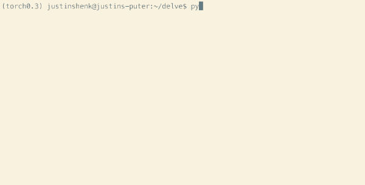
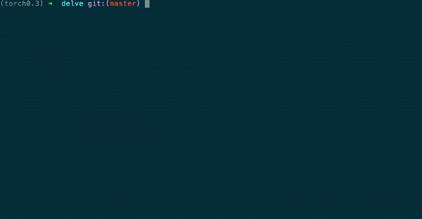
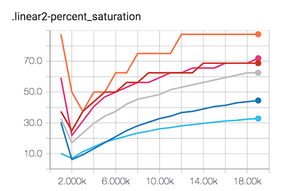

# Delve: Deep Live Visualization and Evaluation

[](https://badge.fury.io/py/delve) [](https://travis-ci.org/justinshenk/delve)

Inspect layer saturation for optimizing your PyTorch or Keras models.

Delve is a Python package for visualizing deep learning model training.

Use Delve if you need a lightweight PyTorch or Keras extension that:
- Plots live statistics of network activations to TensorBoard
- Performs spectral analysis to identify layer saturation for network pruning
- Is easily extendible and configurable

------------------

## Motivation

Designing a deep neural network involves optimizing over a wide range of parameters and hyperparameters. Delve allows you to visualize your layer saturation during training so you can grow and shrink layers as needed.  

## Demo





## Getting Started

```bash
pip install delve
```

### Layer Saturation

#### PyTorch

`delve.CheckLayerSat` can be configured as follows:

```
logging_dir (str)  : destination for summaries
modules (torch modules or list of modules) : layer-containing object
log_interval (int) : steps between writing summaries
stats (list of str): list of stats to collect

    supported stats are:
        lsat       : layer saturation
        bcov       : batch covariance
        eigendist  : eigenvalue distribution
        neigendist : normalized eigenvalue distribution
        spectrum   : top-N eigenvalues of covariance matrix
        spectral   : spectral analysis (eigendist, neigendist, and spectrum)

include_conv       : bool, setting to False includes only linear layers
verbose (bool)     : print saturation for every layer during training
```        
Pass either a PyTorch model or `torch.nn.Linear` layers to `CheckLayerSat`:

```python
from delve import CheckLayerSat

model = TwoLayerNet() # PyTorch network
stats = CheckLayerSat('runs', model) #logging directory and input

... # setup data loader

for i, data in enumerate(train_loader):    
    stats.saturation() # output saturation
```

Only fully-connected and convolutional layers are currently supported.

To log the saturation to console, call `stats.saturation()`. For example:

```bash
Regression - SixLayerNet - Hidden layer size 10                        │
loss=0.231825:  68%|████████████████████▎         | 1350/2000 [00:04<00:02, 289.30it/s]│
linear1:  90%|█████████████████████████████████▎   | 90.0/100 [00:00<00:00, 453.47it/s]│
linear2:  18%|██████▊                               | 18.0/100 [00:00<00:00, 90.68it/s]│
linear3:  32%|███████████▊                         | 32.0/100 [00:00<00:00, 161.22it/s]│
linear4:  32%|███████████▊                         | 32.0/100 [00:00<00:00, 161.24it/s]│
linear5:  28%|██████████▎                          | 28.0/100 [00:00<00:00, 141.11it/s]│
linear6:  90%|██████████████████████████████████▏   | 90.0/100 [00:01<00:00, 56.04it/s]
```

#### Keras

Two classes are provided in `delve.kerascallback`: `CustomTensorBoard`,`SaturationLogger`.

`CustomTensorBoard` takes two parameters:

| Argument | Description |
| --- | --- |
| `log_dir` | location for writing summaries |
| `user_defined_freq` |  frequency for writing summaries |
| `kwargs` | passed to `tf.keras.callbacks.TensorBoard` |

`SaturationLogger` contains two parameters:

| Argument | Description |
| --- | --- |
| `model` | Keras model |
| `input_data` |  data for passing through the model |
| `print_freq` |  frequency for printing |
 
 Example usage:

``` python
from delve.kerascallback import CustomTensorBoard, SaturationLogger

...

# Tensorboard logging
tbCallBack = CustomTensorBoard(log_dir='./runs', user_defined_freq=1)

# Console logging
saturation_logger = SaturationLogger(model, input_data=input_x_train[:2], print_freq=1)

...

# Add callback to Keras `fit` method
model.fit(x_train, y_train,
          epochs=100,
          batch_size=128,
          callbacks=[saturation_logger]) # can also pass tbCallBack
```

Output:

```bash
Epoch 29/100
 128/1000 [==>...........................] - ETA: 0s - loss: 2.2783 - acc: 0.1406
dense_1  : %0.83 | dense_2  : %0.79 | dense_3  : %0.67 |
```

#### Optimize neural network topology

Ever wonder how big your fully-connected layers should be? Delve helps you visualize the effect of modifying the layer size on your layer saturation.

For example, see how modifying the hidden layer size of this network affects the second layer saturation but not the first. Multiple runs show that the fully-connected "linear2" layer (light blue is 256-wide and orange is 8-wide) saturation is sensitive to layer size:




### Log spectral analysis

Writes the top 5 eigenvalues of each layer to TensorBoard summaries:

```python
# PyTorch-only
stats = CheckLayerSat('runs', layers, 'spectrum')
```

Other options


### Intrinsic dimensionality

View the intrinsic dimensionality of models in realtime:


This comparison suggests that the 8-unit layer (light blue) is too saturated and that a larger layer is needed.

### Why this name, Delve?

__delve__ (*verb*):

   - reach inside a receptacle and search for something
   - to carry on intensive and thorough research for data, information, or the like
